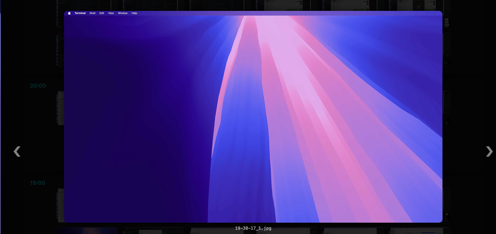
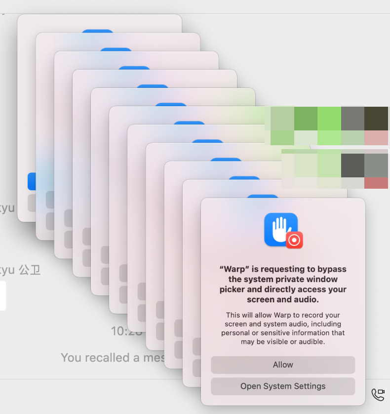

# 📸 Shotline

**Shotline** 是一个基于 Flask 的自动截图时间轴查看器。
它可以定时执行截图脚本，自动记录日志，并通过一个简洁的网页界面浏览截图时间线。

## ✨ 功能特点

- ⏰ 定时截图（可设定时间段）
- 💾 自动保存截图路径与时间记录
- 🌐 本地网页时间轴浏览
- 🔍 点击缩略图可查看大图
- ⬅️➡️ 支持左右切换截图
- 📝 放大模式显示文件名
- 🔄 手动一键截图触发




## 🧩 目录结构

```

Shotline/
├── app.py                 # 主程序（Flask）
├── templates/
│   └── index.html         # 网页前端模板
├── screenshot_log.json    # 截图日志
├── auto_screenshot.sh     # 你的截图脚本
└── README.md              # 项目说明

````

## ⚙️ 配置说明

在 `app.py` 顶部可修改：

```python
SCRIPT_PATH = "/path/to/auto_screenshot.sh"
SCREENSHOT_BASE = "/path/to/Screenshots"
LOG_FILE = "/path/to/screenshot_log.json"
INTERVAL_MIN = 15  # 每隔 15 分钟截图一次
START_HOUR, END_HOUR = 8, 22  # 工作时段
````

## 🚀 启动方法

```bash
# 启动 Flask 应用
python3 app.py
```

启动后访问：

```
http://127.0.0.1:5050
```

## 🖥️ 前端界面功能

- 上方显示当前日期，可点击“前一天 / 后一天”查看历史截图。
- 点击缩略图 → 进入大图模式。
- 大图模式下：

     - 按“❮ / ❯”或点击箭头切换截图；
     - 底部显示文件名；
     - 点击空白处退出。

## 🧠 示例用途

- 研究日志自动留痕；
- 长时间自动截图监控；
- 自动记录网页状态；
- 定期生成时间线式文档记录。

## 🧠 下一步计划

1. ☁️ **集成 WebDAV/SMB 网络存储**
   自动将截图上传或同步至远程文件系统（如 NAS / WebDAV / OneDrive / iCloud Drive）以减少本地占用。

2. 🕓 **按小时倒序展示优化**
   当前日期内的截图按小时分组，最新小时显示在最上方，小时内的截图按时间顺序排列。

3. 📊 **截图统计仪表盘**
   自动统计每日截图数量、时间分布图表。

4. 🔔 **智能通知系统**
   截图失败或未检测到文件时，通过系统通知或邮件提醒。

5. 🧰 **配置文件化**
   将 `SCRIPT_PATH`、时间段、间隔时间等从代码中独立为 `config.yaml`，便于灵活部署。

## 特别说明

一开始用的系统截图，结果 mac 的愚蠢的截图权限系统一直弹出权限请求窗口，最后不得已使用了 shottr 来完成截图的任务，如果有谁解决了这个问题，我认为 screencapture 无疑是一个更优秀的解法。

```txt
"Warp" is requesting to bypass the system private window picker and directly access your screen and audio.

This will allow Warp to record your screen and system audio, including personal or sensitive information that may be visible or audible.
```



## 📄 License

MIT License © 2025 by [Your Name]
